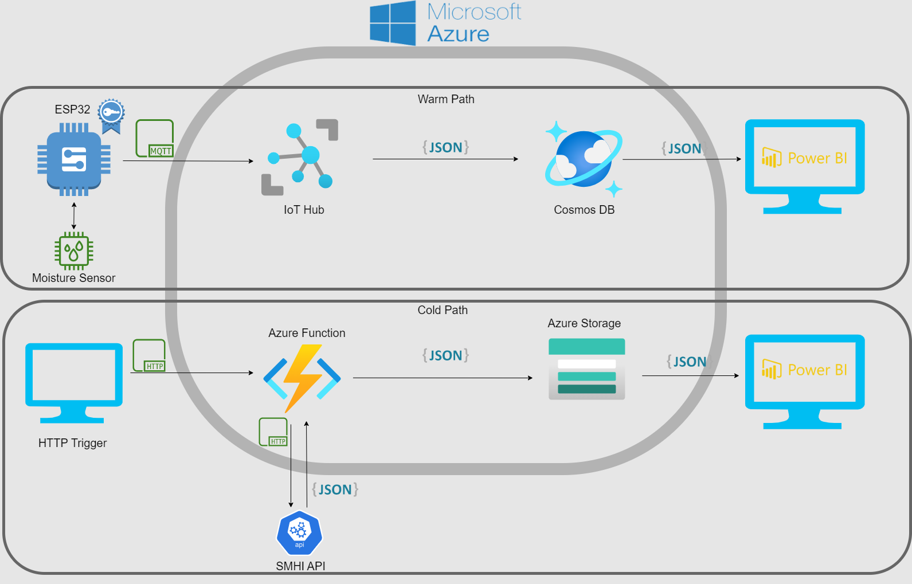

# Moisture Sensor Solution

## Background
I wanted to take better care of the flowers I have in my home, so I decided to build this solution to monitor the moisture level in the soil. This way I will always know when the soil gets to dry and needs watering.

## About

This repository is the base for two other repositories that togheter holds all the code needed to replicate this solution.

#### Code for the ESP32:
https://github.com/FunkMasterPh/MoistureSensorSolutionEsp32

#### Azure Function Code:
https://github.com/FunkMasterPh/MoistureSensorSolutionAzureFunction

This solution also requires Power BI and an active Azure account with these components configured properly:
* IoT Hub
* Azure Functions App
* Cosmos Db 
* Azure Storage

I also use Postman to trigger the Azure Function 

## Architecture

The solution is built with two different paths, one warm and one cold.

### Warm

The warm path collects sensor data from the moisture sensor and using the [Azure IoT SDK for C Arduino](https://github.com/Azure/azure-sdk-for-c-arduino) sends the data to the IoT Hub. The IoT Hub routes the data to Cosmos DB and with Power BI I can fetch and display the data as below:

### Cold

The cold path uses an Azure Function to make a HTTP request to SMHI:s API to get precipitation data for the Stockholm area. 